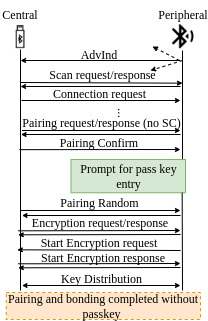

The Bluetooth Low Energy (BLE) is regarded as the most popular short range wireless communication technology in the recent years. According to [reports](https://www.bluetooth.com/2022-market-update/), the number of BLE devices is expected to reach over 7 Billion in the next 4 years including mobile phones, IoT devices, computers, headphones, smart watches, etc. With this large attack surface, adversaries often target BLE devices to bypass security and privacy expectations. To ensure proper security measures, the Bluetooth Special Interest Group (SIG) actively works on updating the protocol specifications and maintaining standards. Despite the efforts, as BLE comprises a complex layered architecture and a plethora of different kinds of devices, having different capabilities and versions, implement the protocol, the implementations often fail to follow the specifications correctly and show noncompliant behavior.  

**BLEDiff** provides an automated black-box noncompliance checking framework for BLE devices and identifies several security issues in the tested devices.

## BLEDiff has been accepted to IEEE S&P 2023  

## Identified Vulnerabilities

    

  Tab.: Summary of identified issues (E: exploitable issue, I: interoperability issue, O: other issue)

### <b>(E1)</b> Bypassing passkey entry in legacy pairing

Among the four association methods, passkey entry is considered secure against Man-in-the-Middle (MitM) attacks. In this method, the initiating device displays a randomly generated value, which the responding device has to enter. Particularly, after the central sends a _PairConfirmSend_ message, a prompt is shown on the peripheral device for passkey entry. In LE legacy pairing, the peripheral device shall send a _PairRandomSend_ only if the _confirm_ value (C_cmp) computed on the device matches the _confirm_ value (C_rcv) received from the central device , i.e., when C_cmp = C_rcv. Otherwise, the responding device would terminate the pairing. **BLEDiff**, however, has uncovered 13 implementations where the device completes pairing and bonding without requiring to enter the passkey in the device and  thereby effectively nullifying all the security protections against MitM attacks.  

    
  Fig.: Passkey entry bypass

In this deviation, if the central sends a _PairRandomSend_, setting the value of the user input passkey to zero, the deviating BLE peripheral implementation responds with a _PairRandomSend_, without sending a _PairConfirmSend_ message and even before taking the input from the user (deviating from the standards). The connection persists even after the user inputs the passkey after an attack with the deviation is performed. Furthermore, the peripheral implementation completes the pairing and bonding process and enables encryption, all assuming the user input to be zero. Surprisingly, one of the devices (Pixel 4a) does not even show the prompt for passkey entry, thus effectively bypassing the MitM protection put into place through the passkey entry association method. This issue has been assigned .  

## Affected Devices  

  Tab.: Summary of affected devices

## Responsible Disclosure Progress

## Open Source Implementation  

Due to responsible disclosure, we are not releasing the implementation of BLEDiff yet. We will provide the open sourced implementation at the [github repository](https://github.com/BLEDiff/BLEDiff) when the responsible disclosure process is complete.
